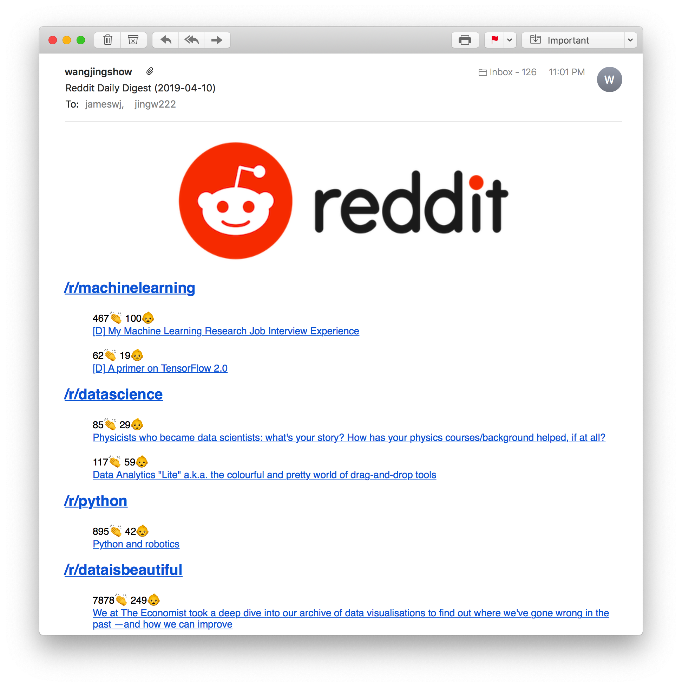

# A Reddit submission highlights bot 

This script fetches top n submissions per subreddit, and sends them via emails if a submission's score or number of comments exceeds a threshold.



## Usage

1. Clone the repository

2. Go to [Reddit](https://www.reddit.com/prefs/apps/) and create a developper application for script use. 

3. Create a `praw.ini` file in the repository folder  following the [doc](https://praw.readthedocs.io/en/latest/getting_started/configuration/prawini.html)

4. Run `reddit_bot.py` with your config options, like below
    ```
    $ python3 reddit_bot.py --reddit_config bot1 --subreddits machinelearning datascience python --from_address fromemail@example.com --from_address_pass password --to_address toemail1@example.com toemail2@example.com
    ```


    *Command line arguments*
    ```
    optional arguments:
    -h, --help            show this help message and exit
    --reddit_config CONFIG
                            specify config section for Reddit config file, e.g. praw.ini
    --subreddits [STRING [STRING ...]]
                            A list of subreddits
    --limit INT           maximum num of posts per subreddit
    --score INT           minimun score on a particular submission
    --num_comments INT    minimun num of comments on a particular submission
    --from_address EMAIL  email addr from which to send contents
    --from_address_pass EMAIL_PASS
                            password for email addr from which to send contents
    --to_address [EMAIL [EMAIL ...]]
                            email addr to which to send contents
    ```

5. Additionally, you can create a `bash` script based off the code in step 4, and setup a `crontab` job for automation tasks.

## License

MIT